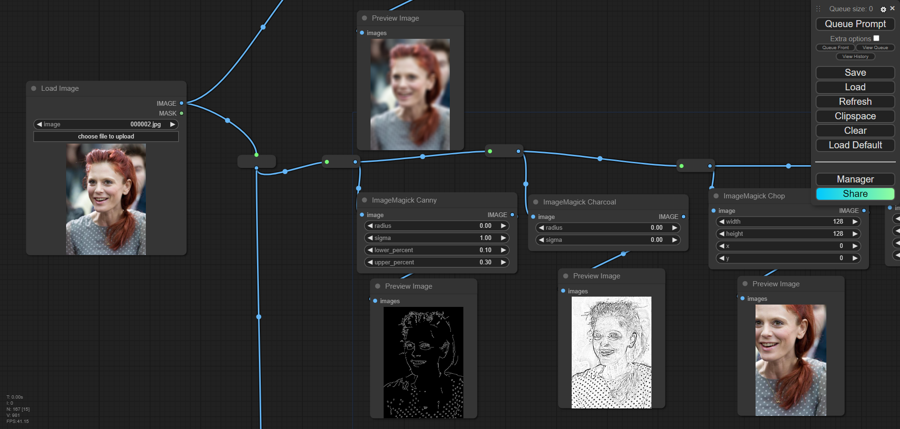

# ComfyUI MagickWand
Proper implementation of ImageMagick - the famous software suite for editing and manipulating digital images to ComfyUI using [wandpy](https://github.com/emcconville/wand)
## Example workflow
* [magickwand_playground.json](./magickwand_playground.json)
* [Input image](./000002.jpg)

## Installation
### Install ImageMagick on your system
#### Install ImageMagick on Windows
* Windows 32-bit: https://imagemagick.org/archive/binaries/ImageMagick-7.1.1-30-Q16-HDRI-x86-dll.exe
* Windows 64-bit: https://imagemagick.org/archive/binaries/ImageMagick-7.1.1-30-Q16-HDRI-x64-dll.exe

For other CPU architectures, please download dynamic builds (ones have "dll" in name). A static or portable build won't work as it doesn't have necessary DLL files
#### Install ImageMagick on Debian/Ubuntu
If you’re using Linux distributions based on Debian like Ubuntu, it can be easily installed using APT:
```sh
sudo apt-get install libmagickwand-dev
```
#### Install ImageMagick on Fedora/CentOS
If you’re using Linux distributions based on Redhat like Fedora or CentOS, it can be installed using Yum:
```sh
yum update
yum install ImageMagick-devel
```
#### Install ImageMagick on Mac
You need one of Homebrew or MacPorts to install ImageMagick.

Homebrew:
```sh
brew install imagemagick
```
MacPorts:
```sh
sudo port install imagemagick
```
If your Python in not installed using MacPorts, you have to export MAGICK_HOME path as well. Because Python that is not installed using MacPorts doesn’t look up /opt/local, the default path prefix of MacPorts packages.
```sh
export MAGICK_HOME=/opt/local
```
### Install custom node suite
There are two ways:
1. Through [ComfyUI-Manager](https://github.com/ltdrdata/ComfyUI-Manager)
2. Run the following command, assuming your terminal is already in ComfyUI folder:
```
cd custom_nodes
git clone https://github.com/Fannovel16/ComfyUI-MagickWand
pip install -r requirements.txt
```
## Supported methods (55)
### Effects
* ImageMagick Blur
* ImageMagick Canny
* ImageMagick Charcoal
* ImageMagick Clahe
* ImageMagick Clamp
* ImageMagick Combine
* ImageMagick Contrast
* ImageMagick Edge
* ImageMagick Emboss
* ImageMagick Equalize
* ImageMagick Kuwahara
* ImageMagick Negate
* ImageMagick Noise
* ImageMagick Normalize
* ImageMagick Shade
* ImageMagick Shadow
* ImageMagick Sharpen
* ImageMagick Sketch
* ImageMagick Solarize
* ImageMagick Spread
* ImageMagick Swirl
* ImageMagick Transparentize
* ImageMagick Wave
### Resizing and cropping
* ImageMagick Chop
* ImageMagick Crop
* ImageMagick Extent
* ImageMagick Resample
* ImageMagick Resize
* ImageMagick Sample
* ImageMagick Shave
* ImageMagick Splice
* ImageMagick Thumbnail
* ImageMagick Transform
* ImageMagick Vignette
### Cipher
* ImageMagick Decipher
* ImageMagick Encipher
### Transformation
* ImageMagick Deskew
* ImageMagick Mode
* ImageMagick Modulate
* ImageMagick Roll
* ImageMagick Statistic
### Distortion
* ImageMagick Distort
* ImageMagick Implode
* ImageMagick Polynomial
* ImageMagick Scale
### Color Enhancement
* ImageMagick Evaluate
* ImageMagick Function
* ImageMagick Gamma
* ImageMagick Level
* ImageMagick Levelize
### Quantize
* ImageMagick Kmeans
* ImageMagick Posterize
* ImageMagick Quantize
### Morphology
* ImageMagick Morphology
### Threshold
* ImageMagick Threshold
